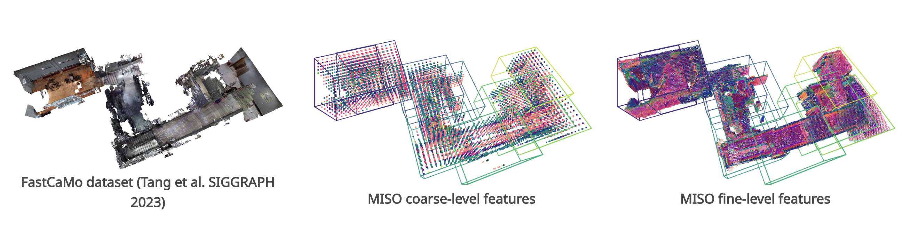
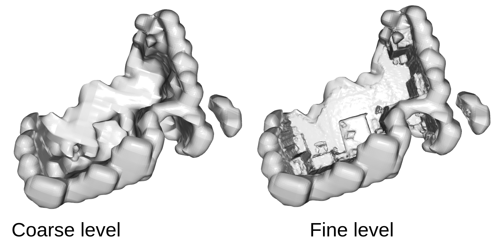

<div align="center">
  <a href="http://erl.ucsd.edu/">
    
  </a>
  <a href="https://contextualrobotics.ucsd.edu/">
    
  </a>
  <a href="https://ucsd.edu/">
    
  </a>
</div>


# MISO: Multiresolution Submap Optimization for Efficient Globally Consistent Neural Implicit Reconstruction

<p align="center">
  📄 <a href="https://arxiv.org/abs/2504.19104"><strong>Paper</strong></a> |
  🌐 <a href="https://existentialrobotics.org/miso_rss25/"><strong>Project Website</strong></a>
</p>

This is the code repository for MISO, a hierarchical optimization approach that leverages multiresolution submaps to achieve efficient and scalable neural implicit reconstruction. For local SLAM within each submap, we develop a hierarchical optimization scheme with learned initialization that substantially reduces the time needed to optimize the implicit submap features. To correct estimation drift globally, we develop a hierarchical method to align and fuse the multiresolution submaps, leading to substantial acceleration by avoiding the need to decode the full scene geometry. 

<p align="center">
    <a href="https://youtu.be/EADUWRSkOKs?si=d8Rs7uKJreQm6Str">
    
    </a>
</p>


## Outline

#### [0. Set up](#set-up)

#### [1. Mapping with groundtruth robot poses](#mapping-with-groundtruth-robot-poses)

#### [2. Submap alignment](#submap-alignment)

#### [3. Full SLAM](#run-the-full-slam)


## Set up

#### A. Download necessary data
Create a `data` folder under the project root,
```
mkdir data && cd data
```
Download the ScanNet and Newer College (optional) datasets from the [google drive](https://drive.google.com/drive/folders/1G2dtW54L4gaMPcZoABJHo7WgNNEngGVg?usp=drive_link), and unzip it to the `data` folder. 

Further make a `results` folder under the project root,
```
cd .. && mkdir results && cd results
```
Download the pretrained decoders from the [google drive](https://drive.google.com/drive/folders/1G2dtW54L4gaMPcZoABJHo7WgNNEngGVg?usp=drive_link) and unzip it to the `results` folder

```
/root/of/the/project
    |———data
    |     |———ScanNet
    |     |      |———scans
    |     |———Newer_College
    |            |———ply
    |            |———...
    |———results
    |     |———trained_decoders
    |            |———decoder_indoor.pt
    |            |———decoder_quad.pt
    |——— ....
    |    
```

#### B. Create the environment

We offer two ways of setting up the environment: docker and conda.

**B1. Use the prebuilt docker image**

```
docker pull hwcao17/miso_lab

xhost +local:

docker run -it --mount type=bind,source=/path/to//MISO-DCIST-Lab,target=/home/MISO-DCIST-Lab --gpus all -e DISPLAY=$DISPLAY -v /tmp/.X11-unix:/tmp/.X11-unix hwcao17/miso_lab:latest
```

**B2. Create a Conda environment**

Then, let's prepare the python environment, run the following command

```
conda env create -f environment.yaml
```

Note that the `torch` installation could be tricky. I have CUDA 11.6 and use the following command
```
pip install torch==1.13.1+cu116 torchvision==0.14.1+cu116 torchaudio==0.13.1 --extra-index-url https://download.pytorch.org/whl/cu116
```
You may also find all the installation commands in [install.sh](./install.sh).

Finally, install the grid opt package

```
pip install -e .
```

## Mapping with groundtruth robot poses
In this example, we use the multiresolution feature grid to build individual submaps on the ScanNet dataset. Run the following command:
```
python demo/build_submaps.py
```

Take `Submap 0` for example, we will see the coarse-level and fine level mesh constructions as following:

<center>

</center>

## Submap alignment
In this example, we run the proposed latent space alignment method to register all submaps consistently in the global reference frame. The following visualizes the alignment process as the submap poses are optimized.
<center>

</center>
To only use the coarse-level features to align the submaps

```
python demo/align_submaps.py --feature_levels 0
```

To use both the coarse-level and the fine-level features to align the submaps

```
python demo/align_submaps.py --feature_levels 0 1
```

To use only the SDF prediction to align the submaps

```
python demo/align_submaps.py --feature_levels --use_sdf
```

## Run the full SLAM

To run on the outdoor quad scene from the Newer College dataset:
```
python demo/full_slam_newer_college.py
```


## Citation

If you found this work useful, we would appreciate if you could cite our work:

- Y. Tian, H. Cao, S. Kim,  N. Atanasov. [**MISO: Multiresolution Submap Optimization for Efficient Globally Consistent Neural Implicit Reconstruction**](https://arxiv.org/pdf/2504.19104). [arXiv:2504.19104](https://arxiv.org/pdf/2504.19104).
 
 ```bibtex
@inproceedings{tian2025miso,
  title={{MISO}: Multiresolution Submap Optimization for Efficient Globally Consistent Neural Implicit Reconstruction},
  author={Tian, Yulun and Cao, Hanwen and Kim, Sunghwan and Atanasov, Nikolay},
  booktitle={Robotics: Science and Systems (RSS)},
  year={2025}
}
```

## Acknowledgments

This repo was built using some awesome third party functions from [iSDF](https://github.com/facebookresearch/iSDF),  [PIN-SLAM](https://github.com/PRBonn/PIN_SLAM), [nglod](https://github.com/nv-tlabs/nglod), and [cuda-gridsample-grad2](https://github.com/AliaksandrSiarohin/cuda-gridsample-grad2).

We gratefully acknowledge support from ARL DCIST CRA W911NF-17-2-0181, ONR N00014-23-1-2353, and NSF CCF-2112665 (TILOS).

## License

[BSD License](LICENSE.BSD)
